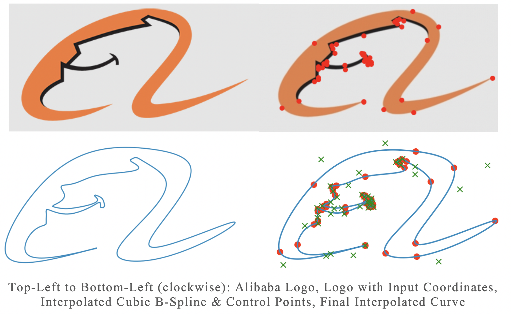

# B-Spline-Interpolation
B-Spline Interpolation Algorithm, as part of a CE7453 Numerical Algorithms assignment.

## Algorithm
Following the cubic b-spline interpolation steps laid out by the de Boor algorithm, the program first opens the input text file and parses the relevant interpolated coordinates into a list. Then, chord-length parameterization was done to generate the knots vector. The knots vector was then padded with zeros and ones corresponding to the degree of the interpolated b-spline, which is three in the case of cubic b-splines. Following the required output format, the knot vector is then appended into the variable ‘spline’ which will be eventually saved as an output ‘cubic.txt’.
